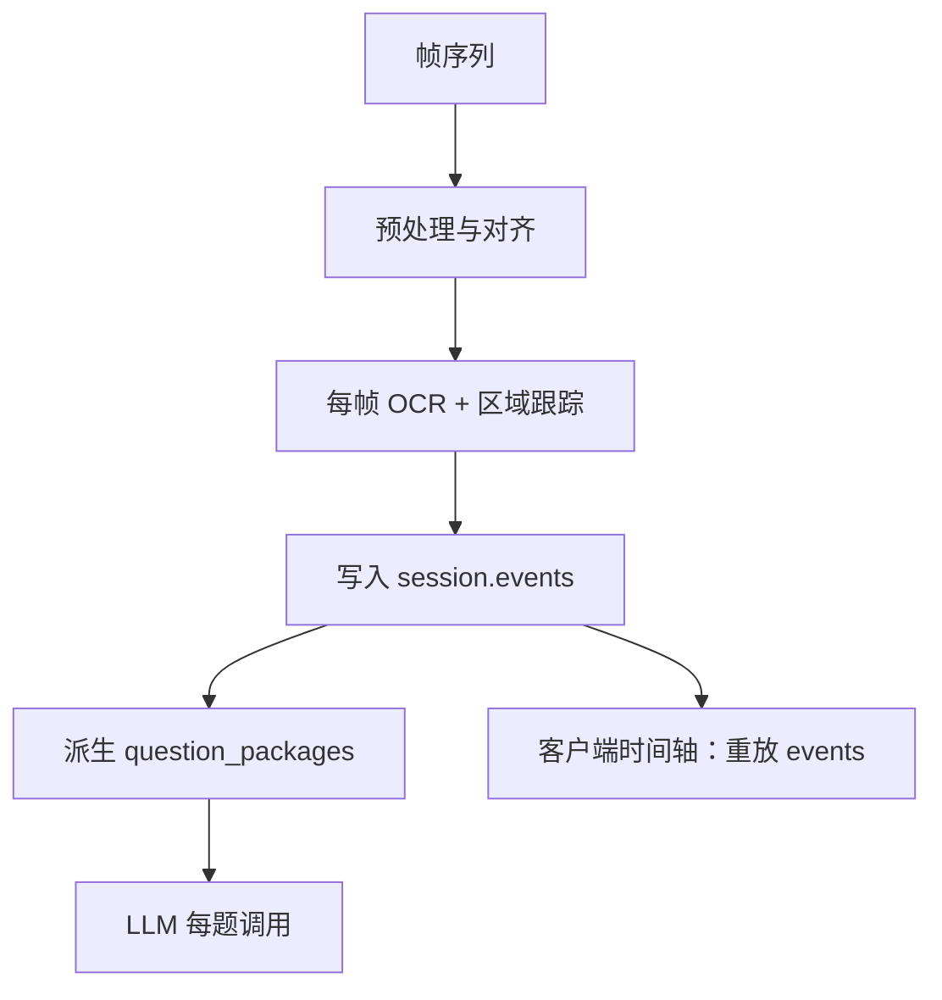
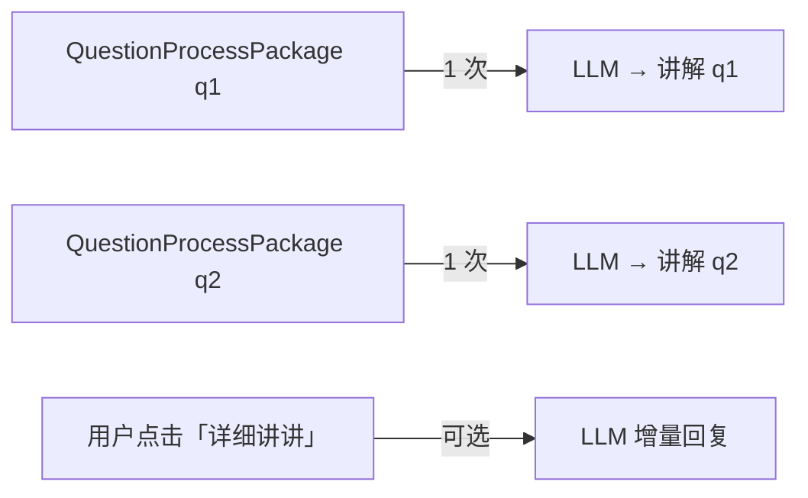

# OCR 会话数据模型与 Schema 设计（v1）

> 版本：v1.3  
> 状态：草案（部分决策已确认）  
> 关联：`workflow-v1.md` 阶段二（过程分析）  
> **Schema 权威路径**：`server/schemas/`（本文档为设计说明）  
> 最后更新：2026-06-22

---

## 1. 需求拆解

你要存储的不是「一张卷面的静态 OCR 结果」，而是：

| 需求 | 含义 |
|------|------|
| 完整作业界面 | 一次会话中卷面上**所有可见文字区域**及其归属（题干 / 作答 / 涂改） |
| 时序变化 | 做题过程中，文字内容**如何随时间演变**（可按时间轴回放） |
| 按题拆分 | 不同题目的解答过程**彼此独立**，可分别送给 LLM |
| LLM 下游 | 每题生成独立讲解（v1 题解思路文本；未来讲解视频） |

核心问题：**用什么数据结构，既能完整保留过程，又便于按题切分、给 LLM 消费？**

---

## 2. JSON 是否是好的格式？

### 2.1 结论：**是，但要分层，不要只有一种 JSON**

| 层级 | 格式 | 用途 |
|------|------|------|
| 权威过程记录 | **JSON（纯事件流）** | 存储、校验、回放时间轴 |
| 帧图像 | **对象存储（文件 URL）** | 原始图 / 关键帧，不进 JSON 本体 |
| 给 LLM 的输入 | **JSON（按题派生包）** | 每题一份自洽上下文，控制 token |
| 未来讲解视频 | **URL + 元数据** | 视频文件外挂，JSON 只存引用 |

**JSON 适合的原因：**

- LLM、前端、后端都能直接消费
- 可用 [JSON Schema](https://json-schema.org/) 做版本校验
- 与「按题拆分后分别调用 LLM」天然契合

**JSON 不适合单独承担的部分：**

- **每秒全量 OCR 快照**：体积爆炸、大量重复（例如 25 分钟 × 1fps ≈ 1500 帧 × 每帧 N 个文本块）
- **原始图片二进制**：应存文件，JSON 只保留 `frame_id` / `uri`

### 2.2 与其他格式对比

| 格式 | 优点 | 缺点 | 是否采用 |
|------|------|------|----------|
| JSON | 可读、LLM 友好、生态好 | 大文档冗余多 | ✅ 主格式 |
| JSONL（每行一事件） | 流式写入、易追加 | 查询整卷要聚合 | 可选作存储落盘格式 |
| SQLite | 查询帧/题方便 | LLM 不直接读；多一层导出 | 可作为内部索引，非对外契约 |
| Protobuf | 紧凑、快 | 人类不可读，LLM 不友好 | ❌ 不作为主交换格式 |
| 视频 + 字幕 | 贴近「讲解视频」 | OCR 过程不是视频语义 | 仅用于未来输出，非过程存储 |

**推荐架构：**

```
原始帧 (文件)  →  OCR/对齐流水线  →  OcrSessionRecord (JSON)
                                         ↓ 派生
                              QuestionProcessPackage[] (每题一份 JSON)
                                         ↓
                                    LLM 讲解 / 未来视频脚本
```

---

## 3. 时序内容：三种建模方式

### 3.1 方案 A：全量快照（Snapshot per frame）

每一帧保存卷面**全部** OCR 文本。

```json
{ "t": 120, "regions": [{ "id": "r1", "text": "12+8=19" }, ...] }
```

| 优点 | 缺点 |
|------|------|
| 实现简单 | 冗余极大 |
| 任意时刻可还原 | 题与区域的跨帧关联要自己算 |

**不推荐**作为唯一模型，可作为调试导出。

---

### 3.2 方案 B：纯事件流（Event Sourcing）✅ 推荐作为权威层

只记录**变化**：某区域何时新建、文本何时变更、何时涂改、何时进入空闲。

```json
{ "type": "answer.changed", "t": 145, "question_id": "q1", "text": "19", "prev": "18" }
```

| 优点 | 缺点 |
|------|------|
| 体积小、语义清晰 | 需要稳定的 `question_id` / `region_id` |
| 时间轴回放自然 | 流水线要能跨帧追踪区域 |
| 按题过滤事件即可拆分 | 实现比快照复杂 |

**推荐**作为 `OcrSessionRecord` 的核心。

---

### 3.3 方案 C：按题分段（Segment per question）

每题一个独立时间线，会话级只保留题列表与全局元数据。

| 优点 | 缺点 |
|------|------|
| 直接给 LLM | 丢失跨题跳转（如先写第 3 题再回第 1 题） |
| 结构简单 | 不适合作为唯一真相源 |

**推荐**作为**派生视图**（`QuestionProcessPackage`），由方案 B 聚合生成，而非采集时直接写。

---

### 3.4 推荐组合：**事件流 + 按题派生包** ✅ v1 已确认



- **events**：过程唯一真相源，支持整卷时间轴回放与按题过滤
- **frames**：稀疏关键帧索引，图像外挂对象存储；`event.frame_id` 可选引用
- **question_packages**：给 LLM 与单题讲解 UI 的派生视图

---

## 4. 数据模型总览

### 4.1 JSON 文档分层

| 文档 | Schema ID | 谁生产 | 谁消费 |
|------|-----------|--------|--------|
| `OcrSessionRecord`（单文件导出） | `home-tutor.ocr-session.v1` | 调试导出 | 迁移脚本 |
| `SessionMeta` + `events.jsonl` | `home-tutor.session-meta.v1` | OCR 流水线 | 存储、审计 |
| `SessionTimelineIndex` | `home-tutor.session-timeline-index.v1` | OCR 流水线（增量） | 讲解页底栏 |
| `QuestionProcessPackage` | `home-tutor.question-package.v1` | OCR 流水线（**增量物化**） | LLM、讲解 UI、mini 时间轴 |
| `TutorContent` | `home-tutor.tutor-content.v1` | LLM / v1 mock | 讲解卡 |

**生产存储布局**（推荐）：

```
sessions/{id}/meta.json
sessions/{id}/events.jsonl      # 权威事件流，追加写
sessions/{id}/timeline-index.json
sessions/{id}/packages/qNN.json # 物化，展示时不派生
sessions/{id}/tutor/qNN.json
```

`prompt_text` 与 `regions` 存放在各题 `packages/`，不重复写入瘦 `meta.json`。

`workflow-v1.md` 里的「分析结果 JSON」≈ 在 `QuestionProcessPackage` 之上再叠 LLM 判题结果；**OCR 层与判题层建议分开**，避免 OCR 重跑时连讲解缓存一起失效。

### 4.2 坐标系约定

任意拍照场景下，所有区域使用**对齐后试卷坐标系**（归一化 0–1 或像素坐标二选一，全项目统一）：

```json
"bbox": { "x": 0.12, "y": 0.34, "w": 0.56, "h": 0.08 }
```

同一 `region_id` 跨帧指向同一物理区域；题切换通过 `question_id` 关联。

---

## 5. Schema：`OcrSessionRecord`（会话级 · 权威过程）

完整 JSON Schema 见 **`server/schemas/ocr-session.v1.schema.json`**。

### 5.1 顶层结构

```json
{
  "schema_version": "home-tutor.ocr-session.v1",
  "session_id": "550e8400-e29b-41d4-a716-446655440000",
  "grade_level": "primary",
  "subject": "math",
  "started_at": "2026-06-22T10:00:00Z",
  "ended_at": "2026-06-22T10:25:00Z",
  "pages": [],
  "questions": [],
  "regions": [],
  "frames": [],
  "events": []
}
```

> v1 不再包含 `snapshots`。任意时刻的卷面文字状态由 **重放 `events`** 得到；印刷题干来自 `questions[].prompt_text`，不重复写入事件。

### 5.2 核心实体

**`questions`** — 题目切分结果（分析流水线产出，非 OCR 单帧产出）

```json
{
  "question_id": "q1",
  "page_id": "page_1",
  "index_on_page": 1,
  "prompt_text": "12 + 8 = ?",
  "prompt_region_ids": ["r_prompt_q1"],
  "answer_region_ids": ["r_answer_q1"],
  "question_type": "fill_blank"
}
```

**`regions`** — 卷面上稳定跟踪的文本区域

```json
{
  "region_id": "r_answer_q1",
  "question_id": "q1",
  "role": "student_answer",
  "bbox": { "x": 0.5, "y": 0.2, "w": 0.15, "h": 0.05 }
}
```

`role` 枚举建议：`printed_prompt` | `student_answer` | `scratch_work` | `unknown`

**`frames`** — 帧索引（图像外挂）

```json
{
  "frame_id": "frame_0145",
  "t_offset_ms": 145000,
  "captured_at": "2026-06-22T10:02:25Z",
  "image_uri": "s3://bucket/sessions/.../frame_0145.jpg",
  "page_id": "page_1"
}
```

**`events`** — 时序变化（权威过程）

| type | 含义 | 关键字段 |
|------|------|----------|
| `session.start` | 开始采集 | `t_offset_ms` |
| `session.end` | 结束采集 | `t_offset_ms` |
| `page.detected` | 检测到新页/翻页 | `page_id`, `frame_id` |
| `question.focus` | 学生**开始**在某题作答（进入本题） | `question_id`, `frame_id` |
| `question.blur` | 学生**离开**某题（**检测到切到另一题时立即触发**） | `question_id`, `frame_id`, `next_question_id`（可选） |
| `answer.appeared` | 某题首次出现手写 | `question_id`, `region_id`, `text` |
| `answer.changed` | 作答内容变化 | `question_id`, `region_id`, `text`, `prev_text` |
| `answer.erased` | 检测到涂改/擦除 | `question_id`, `region_id` |
| `idle.start` / `idle.end` | 卡壳/停笔 | `question_id`, `duration_ms` |
| `ocr.low_confidence` | 识别置信度低 | `region_id`, `confidence` |

示例：

```json
{
  "event_id": "evt_00042",
  "type": "answer.changed",
  "t_offset_ms": 145000,
  "frame_id": "frame_0145",
  "question_id": "q1",
  "region_id": "r_answer_q1",
  "payload": {
    "text": "19",
    "prev_text": "18",
    "confidence": 0.91
  }
}
```

### 5.3 时间轴回放（客户端）

1. 按 `t_offset_ms` 排序 `events` → 事件时间线  
2. 用户拖动到时刻 **T**：取所有 `t_offset_ms ≤ T` 的 events，重放 `answer.*` 得到 `region_id → text`  
3. 印刷题干从 `questions[].prompt_text` 读取；按 `page.detected` / `question.focus` 决定当前可见页  
4. 需要原图时：取 ≤ T 的最近一条带 `frame_id` 的 event → `frames[].image_uri`  
5. 单题讲解页：使用派生后的 `QuestionProcessPackage.answer_timeline`，无需整卷重放

**事件重放**即可支撑时间轴 UI，无需额外 snapshot 层。

### 5.4 跨题跳转：用 `focus` / `blur` 事件表达

学生会跳题（例如先做第 1 题，再做第 2 题，又回第 1 题）。在会话级 `events` 中用成对的 `question.focus` / `question.blur` 记录**当前正在做哪一题**。

**`question.blur` 判定（已确认）：切到另一题立即 blur**，不等待停笔超时。  
即：一旦流水线判定学生开始在 `q2` 作答，则**同一时刻**对 `q1` 写入 `question.blur`，并对 `q2` 写入 `question.focus`。

仍停在本题但长时间不写，属于 **`idle.start` / `idle.end`**（卡壳），**不**触发 `question.blur`。

```
t=1min   question.focus   q1
t=5min   question.blur    q1   (payload: { "next_question_id": "q2" })
t=5min   question.focus   q2
t=8min   question.blur    q2   (payload: { "next_question_id": "q1" })
t=8min   question.focus   q1
t=10min  question.blur    q1
t=10min  session.end
```

派生到 `QuestionProcessPackage` 时，第 1 题得到**不连续**的 `focus_segments`：

```json
"focus_segments": [
  { "segment_index": 1, "start_ms": 60000,  "end_ms": 300000, "duration_ms": 240000 },
  { "segment_index": 2, "start_ms": 480000, "end_ms": 600000, "duration_ms": 120000 }
],
"process_metrics": {
  "active_duration_ms": 360000,
  "revision_count": 2
}
```

`answer_timeline` 中的条目自然只落在上述时间段内；**不需要**单独的 `cross_question_notes` 字段。

---

## 6. Schema：`QuestionProcessPackage`（按题 · LLM 输入）

派生器从 `OcrSessionRecord` 过滤 `question_id = q1` 的所有 events，聚合为一份自洽 JSON。

完整 JSON Schema 见 **`server/schemas/question-package.v1.schema.json`**。

```json
{
  "schema_version": "home-tutor.question-package.v1",
  "session_id": "550e8400-e29b-41d4-a716-446655440000",
  "question_id": "q1",
  "grade_level": "primary",
  "subject": "math",

  "prompt": {
    "text": "12 + 8 = ?",
    "ocr_confidence": 0.94
  },

  "answer_timeline": [
    {
      "t_offset_ms": 130000,
      "kind": "appeared",
      "text": "1",
      "frame_id": "frame_0130"
    },
    {
      "t_offset_ms": 138000,
      "kind": "changed",
      "text": "18",
      "prev_text": "1",
      "frame_id": "frame_0138"
    },
    {
      "t_offset_ms": 145000,
      "kind": "changed",
      "text": "19",
      "prev_text": "18",
      "frame_id": "frame_0145"
    }
  ],

  "final_answer": {
    "text": "19",
    "confidence": 0.91
  },

  "focus_segments": [
    { "segment_index": 1, "start_ms": 60000, "end_ms": 300000, "duration_ms": 240000 },
    { "segment_index": 2, "start_ms": 480000, "end_ms": 600000, "duration_ms": 120000 }
  ],

  "process_metrics": {
    "first_touch_ms": 60000,
    "last_change_ms": 580000,
    "active_duration_ms": 360000,
    "idle_periods_ms": [{ "start_ms": 132000, "end_ms": 136000, "duration_ms": 4000 }],
    "revision_count": 2,
    "stuck": true
  },

  "scratch_work": [
    { "text": "竖式草稿", "region_id": "r_scratch_q1", "confidence": 0.72 }
  ],

  "key_moments": [
    {
      "label": "final_answer",
      "t_offset_ms": 145000,
      "frame_id": "frame_0145",
      "image_uri": "s3://.../frame_0145.jpg"
    }
  ]
}
```

### 6.1 LLM 调用次数：一题一次（主路径）

**你的理解是对的：讲解一道题，默认只需向 LLM 发送一次。**

此前文档里「每题独立调用」指的是：

| 含义 | 次数 | 说明 |
|------|------|------|
| 整张卷子 10 道题 | **10 次** | 每题一份 `QuestionProcessPackage`，各调一次 LLM，彼此并行 |
| **单道题**的首次讲解 | **1 次** | 一个 package 内已含题干、作答时序、`focus_segments`、最终答案，足够生成讲解 |
| 用户追问「再详细讲讲」 | **可选第 2+ 次** | 互动阶段的增量请求，不属于 OCR 分析流水线 |

**不是**说同一道题在分析阶段要多次发送 package。`scratch_work` 等问题指的是「这一次请求里带哪些字段」，不是「同一题发几遍」。



### 6.2 为何按题拆成多份 package（而不是一次发整卷）？

| 整份 Session 一次发送 | 每题一份 package |
|----------------------|------------------|
| 10 题 token 合在一起，成本高 | 每题一次，可并行 |
| 一题失败整卷重试 | 单题重试 |
| 未来「每题一个讲解视频」难拆 | 天然一题一脚本 |

**按题拆分 ≠ 一题多次发送**；是「多题多次、一题一次」。

### 6.3 与未来「讲解视频」的衔接

在 `QuestionProcessPackage` 上增加 LLM 输出层 `TutorScript`（v1 可先只做文本）：

```json
{
  "schema_version": "home-tutor.tutor-script.v1",
  "question_id": "q1",
  "segments": [
    { "type": "narration", "text": "我们先看第 1 题……", "ref_moment": "final_answer" },
    { "type": "highlight", "target": "carry_step", "duration_ms": 3000 }
  ],
  "video_uri": null
}
```

v1：`video_uri = null`，客户端渲染互动 UI；  
未来：同一 `segments` 驱动 TTS + 关键帧动画 → 生成 `video_uri`。

---

## 7. 与现有 `workflow-v1` 分析 JSON 的关系

```
OcrSessionRecord          ← OCR + 对齐 + 区域跟踪（本文档）
        ↓ 派生
QuestionProcessPackage    ← 按题过程摘要（本文档）
        ↓ LLM 判题 + 讲解策略
AnalysisResult / TutorScript  ← workflow-v1 §4.4 / §5.3（判题与讲解层）
```

**建议拆分**，不要一个 JSON 包打天下：

- OCR 重跑 ≠ 必须重跑 LLM 讲解（若题干与最终答案未变）
- 职责清晰，便于单测与版本演进

---

## 8. 体积与性能（粗算）

假设：25 分钟会话，1 fps，10 道题，平均每题 5 次 `answer.changed`。

| 模型 | 约略条目数 | 量级 |
|------|------------|------|
| 全量快照（已废弃） | 1500 × 10 regions | 大，MB 级 JSON |
| **事件流（v1）** | ~50–200 events | 小，KB–几十 KB |
| 10 个 QuestionPackage | 10 份 | 每份几 KB |

**7 天留存**下，事件流 + 稀疏关键帧对象存储是可持续方案。

---

## 9. v1 实现建议（最小闭环）

1. 流水线输出 **`OcrSessionRecord`**，至少包含：`questions`、`events`（`answer.*`、`idle.*`）、`frames`  
2. 实现 **`derive_question_packages(session) -> QuestionProcessPackage[]`**  
3. LLM 接口：每题 **1 次** 调用 `QuestionProcessPackage` 生成首次讲解  
4. 客户端时间轴：先只做 `events` + `key_moments` 图片，不追求像素级书写轨迹  
5. JSON Schema 校验放在 API 边界（写入 DB 前 / 返回客户端前）

---

## 10. 开放问题（后续可定）

1. **多页试卷**：`page_id` 与 `question_id` 的归属在翻页时如何更新？  
2. **一题多作答区**（如口算 + 竖式）：`answer_region_ids` 数组是否足够？  
3. **`scratch_work`** 是否在首次 LLM 请求中默认包含，还是仅 `stuck=true` 时附带？

---

## 11. 修订记录

| 版本 | 日期 | 说明 |
|------|------|------|
| v1.0 | 2026-06-22 | 初稿：JSON 分层、事件流模型、两类 Schema、LLM 按题拆分 |
| v1.1 | 2026-06-22 | 澄清 LLM 一题一次；`focus_segments` 表达跨题跳转；新增 `question.blur` |
| v1.2 | 2026-06-22 | 确认 `question.blur`：切到另一题立即触发；停笔用 `idle.*` |
| v1.3 | 2026-06-22 | 确认 v1 为 **events-only**：移除 `snapshots`；时间轴与按题派生均基于事件重放 |
