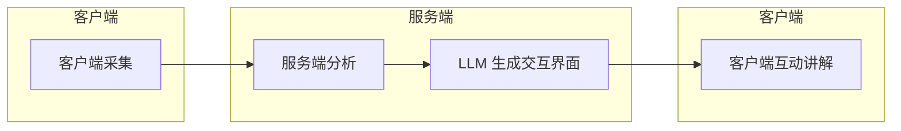
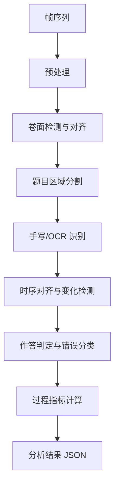

# Home Tutor 产品流程设计（v1）

> 版本：v1.1  
> 状态：产品决策已确认，持续迭代  
> 最后更新：2026-06-22

## 1. 产品概述

Home Tutor 是一款面向**小学生**的**作业过程辅导**应用：通过摄像头持续采集学生写作业的画面，在**做完作业后**由服务端分析「作业如何随时间变化」，再基于分析结果由大模型生成交互式讲解界面，帮助学生理解自己的作答过程、错误原因与正确思路。

**核心价值：**

- 不只判断「对错」，而是还原**做题过程**（用时、卡顿、思路变化）
- 讲解按题定制：对的题一笔带过，错的题按错误类型分层讲解
- 互动式辅导，而非静态答案解析
- 支持**任意试卷拍照**，无需应用内预制题库

### 1.1 v1 产品决策（已确认）

| 决策项 | 结论 | 对实现的影响 |
|--------|------|--------------|
| 试卷来源 | **任意拍照** | 需通用版面分析 + 透视校正；不能依赖固定模板 |
| 题目与标答 | **OCR 识别题干 + LLM 解题/判题/讲解** | 无题库匹配；LLM 承担解题、对错判定与辅导生成 |
| 分析时机 | **做完再讲** | 会话结束后批量上传并触发分析；v1 不做边写边反馈 |
| 目标用户 | **小学** | 讲解语气浅显、鼓励为主；UI 字号大、操作少、分支简单 |
| 数据留存 | **原始照片保留 7 天** | 到期自动删除；分析 JSON / 讲解记录可单独约定留存策略 |

---

## 2. 端到端流程（四阶段）



| 阶段 | 执行方 | 输入 | 输出 |
|------|--------|------|------|
| 1. 图像采集 | 客户端 | 摄像头视频流 | 按时间戳归档的帧序列 / 关键帧 |
| 2. 过程分析 | 服务端 | 帧序列 + 会话元数据 | 结构化分析 JSON |
| 3. 讲解生成 | 服务端（LLM） | 分析 JSON + 学科/试卷上下文 | 互动界面描述（UI Schema + 讲解脚本） |
| 4. 互动展示 | 客户端 | 互动界面描述 | 用户与 AI 辅导的对话与可视化 |

---

## 3. 阶段一：客户端图像采集

### 3.1 目标

在用户做作业期间，以固定或可配置间隔（**v1 建议默认 1 秒/帧**）从摄像头获取画面，记录**作业卷面随时间的变化**，为后续「过程分析」提供素材。

### 3.2 行为说明

1. 用户进入「开始做作业」会话，授权摄像头
2. 客户端按间隔抓拍（或从视频流抽帧），为每帧附加：
   - `timestamp`：采集时间
   - `session_id`：本次作业会话 ID
   - `frame_index`：序号
   - （可选）`trigger`：定时 / 画面变化超过阈值
3. 帧数据在本地暂存；**v1 不做实时上传分析**
4. 用户点击「做完了」结束会话后，批量上传帧图，通知服务端触发分析流水线（**做完再讲**）

### 3.3 v1 范围与约束

| 项 | v1 建议 |
|----|---------|
| 采集间隔 | 1 s（可配置，范围 0.5–3 s） |
| 分辨率 | 720p 或 1080p，平衡 OCR 与带宽 |
| 上传策略 | 会话结束后批量上传；或每 N 帧一批 |
| 本地缓存 | 断网时暂存，恢复后补传 |
| 隐私 | 原始照片服务端留存 **7 天** 后自动删除；客户端可提供「立即删除」 |
| 拍摄引导 | 任意试卷场景下，需提示用户对准、光线充足、减少遮挡 |

### 3.4 任意拍照场景下的客户端职责（v1）

因支持**任意试卷**（练习册、作业本、试卷纸等），客户端需在采集前/采集中提供：

- 拍摄框与对齐提示（减少严重斜拍）
- 检测到画面过暗、模糊、大面积遮挡时的轻提示
- 多页作业：鼓励按页完成后再翻页，并在元数据中记录 `page_hint`（v1 可粗粒度）

### 3.5 待优化（v2+）

- **变化检测触发**：画面静止时降频采集，有书写动作时提频，节省带宽与算力
- **透视校正**：斜拍试卷的几何矫正（v1 服务端预处理也需做基础版）
- **多页试卷**：翻页检测与页码关联

---

## 4. 阶段二：服务端过程分析

### 4.1 目标

对一段时间内采集的图像序列进行分析，还原：

- 试卷结构（有哪些题）
- 每道题的**作答内容**与**对错**
- 每道题的**耗时**（首次落笔 → 本题完成或停笔）
- **卡壳点**（长时间停笔、反复涂改、跨题跳转）
- **解题思路线索**（从书写顺序、公式、步骤推断）

最终输出一份**结构化 JSON**，供 LLM 生成讲解使用。

### 4.2 分析流水线（建议架构）



**子步骤说明：**

| 步骤 | 说明 | 业界可参考方向 |
|------|------|----------------|
| 预处理 | 去噪、对比度、可选透视变换 | 经典 CV：OpenCV 文档扫描 |
| 卷面检测与对齐 | 将连续帧对齐到同一试卷坐标系 | 特征点匹配 / 光流 / 文档配准 |
| 题目区域分割 | 切出各题 ROI | 通用版面分析（**无固定模板**）；检测印刷题干区 vs 手写答题区 |
| 手写/OCR 识别 | 识别印刷题干、手写答案、涂改 | PaddleOCR 等；小学数学以数字、四则运算、简单文字为主 |
| 时序对齐与变化检测 | 对比相邻帧，定位「何时写了什么」 | 帧差分、语义变化检测；书写轨迹重建（难度较高） |
| 作答判定与错误分类 | **OCR 题干 → LLM 解题得标答 → 与学生作答比对** | LLM 判题 + 错误类型归纳（思路/计算） |
| 过程指标 | 用时、停顿、修改次数 | 学习分析（Learning Analytics）中的 time-on-task、hesitation |

### 4.3 业界公开方案参考（非穷举）

以下为可调研、组合或借鉴的方向。**v1 在「任意拍照 + 小学数学」场景下做最小闭环**：

| 领域 | 公开方案 / 工具 | 与本产品的关系 |
|------|-----------------|----------------|
| 文档/OCR | [PaddleOCR](https://github.com/PaddlePaddle/PaddleOCR)、[Tesseract](https://github.com/tesseract-ocr/tesseract) | 识别印刷题干与手写答案 |
| 公式识别 | [LaTeX-OCR](https://github.com/lukas-blecher/LaTeX-OCR)、商业 API（Mathpix 等） | 数学试卷步骤与公式 |
| 版面分析 | [LayoutParser](https://github.com/Layout-Parser/Layout-Parser)、PubLayNet 类模型 | 题目块、选项、答题区切分 |
| 文档图像增强 | OpenCV 透视变换、DocTR | 斜拍、光照不均 |
| 时序变化 | 帧差 + 对齐后的 ROI diff；视频理解模型（成本更高） | 定位「何时写了哪一题」 |
| 自动判题 | 规则 + LLM（如 GPT-4V / 专用数学模型） | 对错与步骤合理性 |
| 学习分析 | time-on-task、error classification 教育测量文献 | 卡壳、耗时指标定义 |
| 相似产品思路 | 拍照搜题（答案导向）、智能批改（结果导向） | 本产品侧重**过程**与**互动讲解** |

**v1 务实路径建议（基于已确认决策）：**

1. **任意试卷**：服务端做文档矫正 + 通用版面分析，按视觉块切题（不依赖题库或模板 ID）  
2. **OCR 识题**：从印刷/打印题干提取 `question_text`；手写区识别 `student_answer`  
3. **LLM 解题**：根据 OCR 题干生成 `correct_answer` 与简要解题步骤（小学数学）  
4. **LLM 判题**：比对学生作答，输出对错 + `error_classification`（思路/计算/未完成）  
5. 用时序帧 diff 识别「每题何时开始写、何时停笔」；卡壳启发式：单题区域连续多帧无变化且时长 > 阈值 → `stuck`  
6. 思路摘要：从 OCR 到的中间步骤 + 时序信息做粗粒度 `solution_approach_detected`

### 4.4 分析结果 JSON（草案）

以下为 v1 目标 schema，字段可在实现中微调，但应保持 **LLM 可消费、客户端可展示**。

```json
{
  "session_id": "uuid",
  "grade_level": "primary",
  "subject": "math",
  "paper_title": null,
  "paper_source": "user_photo",
  "started_at": "2026-06-22T10:00:00Z",
  "ended_at": "2026-06-22T10:25:00Z",
  "summary": {
    "total_questions": 10,
    "correct_count": 7,
    "wrong_count": 3,
    "total_duration_sec": 1500
  },
  "questions": [
    {
      "question_id": "q1",
      "question_text": "12 + 8 = ?",
      "question_type": "fill_blank",
      "student_answer": "19",
      "correct_answer": "20",
      "is_correct": false,
      "timing": {
        "first_touch_at": "2026-06-22T10:02:10Z",
        "last_change_at": "2026-06-22T10:04:30Z",
        "duration_sec": 140,
        "idle_periods_sec": [45, 20]
      },
      "process_signals": {
        "erasures_count": 2,
        "stuck": true,
        "stuck_reason_hint": "long_idle_before_answer"
      },
      "error_classification": {
        "category": "calculation_error",
        "subcategory": "carry_mistake",
        "confidence": 0.85
      },
      "solution_approach_detected": "竖式加法，进位步骤未写清",
      "key_frames": ["frame_120", "frame_145", "frame_180"]
    }
  ],
  "metadata": {
    "analysis_version": "1.0.0",
    "models_used": ["paddleocr", "gpt-4o"],
    "correct_answer_source": "llm_from_ocr_question",
    "frame_retention_days": 7,
    "frames_expire_at": "2026-06-29T10:25:00Z"
  }
}
```

**错误分类（v1 建议枚举）：**

| `category` | 含义 | 讲解策略倾向 |
|------------|------|--------------|
| `correct` | 正确 | 一句带过，用户可要求展开 |
| `concept_error` | 思路/概念错误 | 仔细讲解，重建知识点 |
| `calculation_error` | 计算失误 | 相对简短，强调验算 |
| `incomplete` | 未答完 / 步骤缺失 | 引导补全思路 |
| `unknown` | 无法判定 | 通用引导 + 邀请用户描述 |

---

## 5. 阶段三：LLM 生成交互讲解界面

### 5.1 目标

将阶段二的 **分析 JSON** 作为输入，由大模型生成：

1. **讲解策略**（每题讲多少、什么语气、是否主动展开）  
2. **互动界面描述**（组件树 + 文案 + 分支逻辑），而非仅一段纯文本  

客户端根据该描述渲染 UI，并支持用户追问（「这题再详细讲一下」）。

### 5.2 讲解策略规则（产品层 · 小学）

讲解语气：**短句、鼓励、少术语**；多用「我们来看一下」「再试一次」；避免长段落。

| 题目状态 | 默认讲解深度 | 用户可触发 |
|----------|--------------|------------|
| 正确 | 极简确认（1–2 句，如「这题对了，很棒！」） | 「详细讲讲」「换种方法」 |
| 错误 - 思路错误 | 分小步讲解 + 打比方 | 「举个例子」「再出一道类似的」 |
| 错误 - 计算错误 | 指出错在哪一步 + 验算口诀 | 「帮我检查一遍计算」 |
| 卡壳 | 先问「是不是卡在这里？」再给提示阶梯 | 「给提示」「直接讲」 |

**标答与讲解内容均来自 LLM**：输入为 OCR 题干 + 学生作答 + 过程分析 JSON；**不依赖外部题库**。

### 5.3 输出形态（建议）

LLM 输出宜为 **结构化 UI DSL**（JSON），便于客户端稳定渲染，例如：

```json
{
  "tutor_session_id": "uuid",
  "title": "本次数学练习讲解",
  "opening_message": "你完成了 10 道题，对了 7 道。我们重点看错的 3 道。",
  "sections": [
    {
      "type": "question_review",
      "question_id": "q1",
      "display_mode": "brief",
      "components": [
        { "type": "text", "content": "第 1 题你算成了 19，正确答案是 20。" },
        { "type": "highlight", "target": "carry_step", "label": "进位这里容易错" },
        { "type": "action", "id": "explain_more", "label": "详细讲解" }
      ],
      "branches": {
        "explain_more": { "display_mode": "detailed", "components": [] }
      }
    }
  ],
  "global_actions": ["下一题", "回顾试卷", "结束"]
}
```

**v1 可简化为：** 固定几种 `component` 类型（`text`、`image`（关键帧）、`button`、`hint_ladder`），由 LLM 填充内容。

### 5.4 LLM 集成注意点

- **输入**：OCR 题干 + 学生作答 + 分析 JSON（含 LLM 已生成的标答与错因）  
- **输出**：严格 JSON schema（可用 structured output / function calling）  
- **小学适配**：控制单次输出字数；优先按钮式交互，少打字  
- **安全**：不替代教师/家长最终判断；敏感内容过滤；讲解须引用分析 JSON 字段，降低幻觉  
- **成本**：整卷一次生成 + 按用户点击增量生成「详细讲解」

---

## 6. 阶段四：客户端互动展示

### 6.1 目标

根据服务端返回的 **互动界面描述**，渲染辅导会话，支持：

- 按题浏览讲解  
- 点击「详细讲解」「给提示」等分支  
- （可选）语音播报、关键帧对照（用户当时写的那几帧）  
- WebSocket 流式更新 AI 回复（长讲解时体验更好）

### 6.2 界面模块（v1 · 小学）

| 模块 | 说明 |
|------|------|
| 会话总览 | 正确率、总用时、错题列表；视觉元素大、文案简短 |
| 单题讲解卡 | 题干、学生答案、正误、讲解文案 |
| 关键帧对照 | 展示 `key_frames` 对应图片（7 天内有效） |
| 互动区 | **以按钮 / 快捷追问为主**；自由输入为辅助 |
| 进度导航 | 上一题 / 下一题 / 回到总览 |
| 等待分析页 | 「做完再讲」：上传与分析进度，适合儿童理解的等待动画与文案 |

### 6.3 通讯方式映射

| 场景 | 协议 |
|------|------|
| 上传帧图、拉取分析结果、拉取 UI DSL | HTTP |
| 流式讲解、追问对话 | WebSocket |
| 大体积实时传图（若 v1 不做可延后） | WebRTC |

---

## 7. v1 范围边界

**纳入 v1：**

- **小学生**用户；**任意拍照**试卷（v1 学科侧重：**小学数学**）  
- 固定间隔采帧 + **做完后**批量上传并触发分析  
- **OCR 识题 + LLM 解题/判题/讲解**（无题库）  
- 分析 JSON 核心字段（对错、用时、简单卡壳、错误类型）  
- LLM 生成简化版互动 DSL + 客户端基础渲染  
- 正确题简讲、错题分类型讲解策略  
- 原始帧图服务端留存 **7 天** 后自动删除  

**明确延后：**

- 多学生、多设备同步  
- **边写边分析 / 实时提示**（已确认 v1 不做）  
- 高精度书写轨迹重建  
- 预制题库、试卷模板市场  
- 语音多模态讲解  
- 初中及以上学段适配  

---

## 8. 数据留存与隐私（v1）

| 数据类型 | 留存策略 | 说明 |
|----------|----------|------|
| 原始帧图 | **7 天** | 到期自动删除；用于过程分析与关键帧展示 |
| 分析 JSON | 建议 ≥ 7 天或与帧图一致 | 待实现时可在配置中单独定义 |
| 讲解会话记录 | 建议长期（仅文本/DSL） | 便于学生复习；不含原始照片 |
| 模型训练 | **v1 默认不用于训练** | 除非后续单独获得用户同意 |

客户端需展示简要隐私说明：采集目的、7 天删除、谁可查看（学生/家长）。

---

## 9. 风险与待验证假设

### 9.1 技术风险

| 风险 | 说明 | 缓解 |
|------|------|------|
| 任意试卷版面杂乱 | 无模板，切题难度高 | 文档矫正 + 通用版面分析；v1 先支持结构较清晰的练习 |
| 拍摄质量 | 光线、抖动、遮挡影响 OCR | 拍摄引导 UI；预处理增强 |
| 时序对齐难 | 手遮挡、翻页导致帧不对齐 | v1 依赖最终态识别 + 粗粒度时间窗 |
| LLM 解题/判题偏差 | 小学题 OCR 错误会传导至标答 | 题干置信度低时标记 `unknown`，讲解中请用户确认题目 |
| LLM 幻觉 | 讲解与真实作答不符 | 讲解严格引用 JSON 字段；关键事实校验 |

### 9.2 产品假设（需验证）

1. **1 秒/帧** 对小学书写过程足够，且「做完再传」带宽可接受  
2. 家长愿意让孩子持续开启摄像头完成作业  
3. 「思路错误 vs 计算错误」对小学辅导有足够价值  
4. 互动 DSL + 大按钮比纯聊天更适合小学生  
5. **7 天**关键帧留存足够复习，且满足隐私预期  

---

## 10. 与代码仓库的对应关系（当前架构）

```
client/   → 阶段一（采集）、阶段四（互动 UI）
server/
  api/           → 上传、查询分析、下发 UI DSL
  services/
    analysis/    → 阶段二流水线
    llm/         → 阶段三讲解生成
```

后续可为每个阶段补充独立的技术设计文档（如 `analysis-pipeline-v1.md`、`tutor-ui-dsl-v1.md`）。

---

## 11. 修订记录

| 版本 | 日期 | 说明 |
|------|------|------|
| v1.0 | 2026-06-22 | 初稿：四阶段总流程、JSON 草案、业界参考、边界与 open questions |
| v1.1 | 2026-06-22 | 确认：任意拍照、OCR+LLM、做完再讲、小学学段、帧图留存 7 天 |
